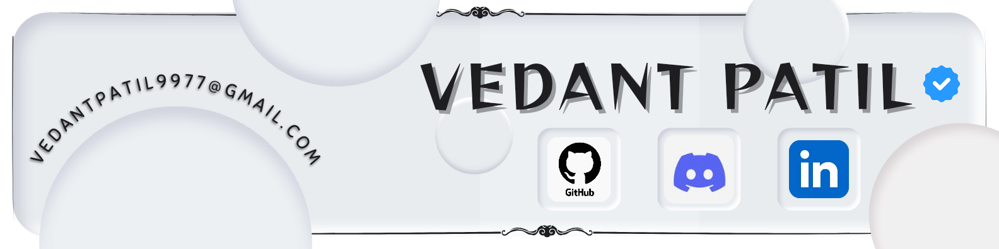

# 💫 About Me:
<!--  -->
<!--  -->

 <kbd></kbd>

 

  I enjoy exploring new technologies and developing quick hacks. 🎓  I'm studying <code>Artificial Intelligence And Machine Learning</code> at KIT's College of Engineering. 🌱  I'm on track to learn more about <code>Artificial Intelligence, DSA, UI-UX</code> ✍️  In my free time, I pursue <code>design and editing</code> as hobbies/side hustles. ✉️  You can shoot me an email at <a href="mailto: vedantpatil9977@gmail.com">vedantpatil9977@gmail.com,</a>! I'll try to respond as soon as I can. 📄  Please look at my [Résumé] for more details about me. I'm open to feedback and suggestions!

   

# 💻 Tech Stack:

     &nbsp;
     &nbsp;
     &nbsp;
     &nbsp;
     &nbsp;
     
     &nbsp;
     &nbsp;
     &nbsp;
     &nbsp;
     &nbsp;
     &nbsp;
     &nbsp;
     &nbsp;
     &nbsp;
     &nbsp;
     &nbsp;
     &nbsp;
     
     &nbsp; 
     &nbsp;
     &nbsp;
     &nbsp;
     &nbsp;
     &nbsp;

   

# 📊 GitHub Stats:

     
     
    

   

## 🏆 GitHub Trophies

   

### ✍️ Random Dev Quote

   

### 🔝 Top Contributed Repo

---

   

## 🌐 Socials:

     &nbsp;&nbsp;
     &nbsp;&nbsp;
     &nbsp;&nbsp;
     &nbsp;&nbsp;
     &nbsp;

<!-- Proudly created with GPRM ( https://gprm.itsvg.in ) -->
